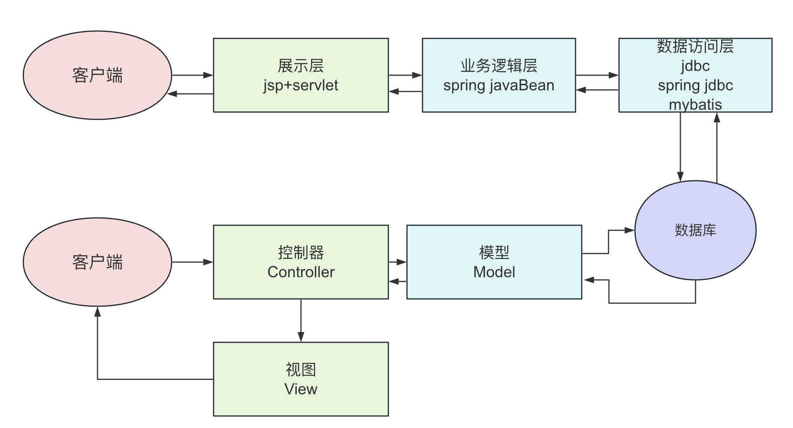
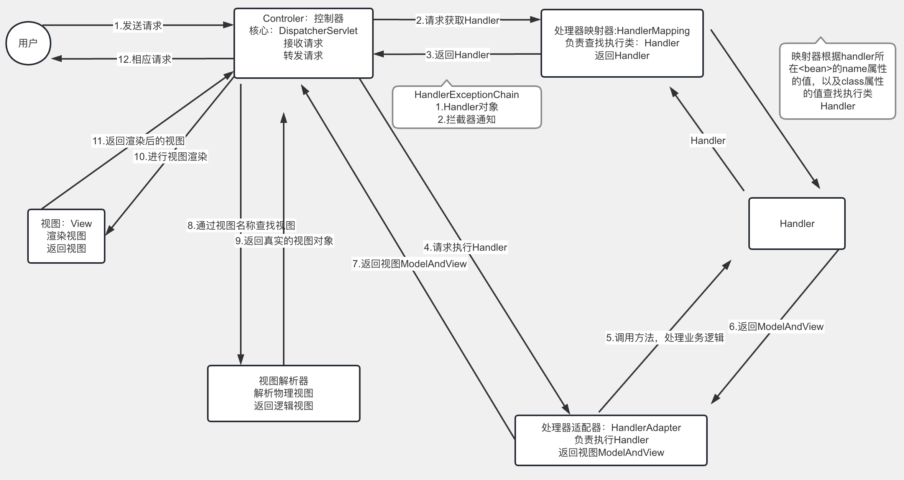

## 1.MVC与三层架构

### 三层架构

三层架构就是为了符合“高内聚，低耦合”思想，把各个功能模块划分为表示层（UI）、业务逻辑层（BLL）和数据访问层（DAL）三层架构，各层之间采用接口相互访问，并通过对象模型的实体类（Model）作为数据传递的载体，不同的对象模型的实体类一般对应于数据库的不同表，实体类的属性与数据库表的字段名一致。

### MVC

经典MVC模式中，M是指模型，V是视图，C则是控制器，使用MVC的目的是将M和V的实现代码分离，从而使同一个程序可以使用不同的表现形式。

M即model模型是指模型表示业务规则。在MVC的三个部件中，模型拥有最多的处理任务。被模型返回的数据是中立的，模型与数据格式无关，这样一个模型能为多个视图提供数据，由于应用于模型的代码只需写一次就可以被多个视图重用，所以减少了代码的重复性。

V即View视图是指用户看到并与之交互的界面。比如由html元素组成的网页界面，或者软件的客户端界面。MVC的好处之一在于它能为应用程序处理很多不同的视图。在视图中其实没有真正的处理发生，它只是作为一种输出数据并允许用户操作的方式。

C即controller控制器是指控制器接受用户的输入并调用模型和视图去完成用户的需求，控制器本身不输出任何东西和做任何处理。它只是接收请求并决定调用哪个模型构件去处理请求，然后再确定用哪个视图来显示返回的数据。

## 2.Spring MVC介绍

Spring Web MVC是基于Servlet API构建的原始Web框架，从一开始就包含在Spring框架中。正式名”“SpringWebMVC”来自其源模块（Spring-webmvc）的名称，但它更常见的名称是“SpringMVC”。



## 3.快速开始

### 导入依赖

```xml
<dependency>
    <groupId>org.springframework</groupId>
    <artifactId>spring-webmvc</artifactId>
    <version>5.1.6.RELEASE</version>
</dependency>
```

### 配置核心(前端)控制器——DispatcherServlet

所有请求都会经过该核心控制器。


> 作为一个MVC框架，首先要解决的是：如何能够收到请求.
>
> 所以MVC框架大都会设计一款前端控制器，选型在 Servlet 或 Filter两者之一,在框架最前沿率先工作，接收所有请求。
>
> 此控制器在接收到请求后，还会负责springMVC的核心的调度管理，所以既是前端又是核心。

```xml
<servlet>
    <servlet-name>mvc</servlet-name>
    <servlet-class>org.springframework.web.servlet.DispatcherServlet</servlet-class>
    <!-- 局部参数：声明配置文件位置 -->
    <init-param>
        <param-name>contextConfigLocation</param-name>
        <param-value>classpath:mvc.xml</param-value>
    </init-param>
    <!-- Servlet启动时刻：可选 -->
    <load-on-startup>1</load-on-startup>
</servlet>
<servlet-mapping>
    <servlet-name>mvc</servlet-name>
    <url-pattern>/</url-pattern>
</servlet-mapping>
```

### 后端控制器

> 等价于之前定义的Servlet

```java
@Controller //声明这是一个控制器
@RequestMapping("/hello")  //访问路径 ，等价于url-pattern
public class HelloController {
	@RequestMapping("/test1")  //访问路径
	public String hello1(){
		System.out.println("hello world");
		return "index"; // 跳转:/index.jsp  
	}
	@RequestMapping("/test2") //访问路径
	public String hello2(){
		System.out.println("hello c9");
		return "views/users";//  跳转:/views/user.jsp
	}
}
```

### 配置文件

> 默认名称：核心控制器名-servet.xml     默认位置：WEB-INF
>
> 随意名称：mvc.xml           随意位置：resources    但需要配置在核心控制器中

```xml
<beans 	xmlns="http://www.springframework.org/schema/beans"
		xmlns:context="http://www.springframework.org/schema/context"
		xmlns:mvc="http://www.springframework.org/schema/mvc" 
		xmlns:xsi="http://www.w3.org/2001/XMLSchema-instance" 
		xsi:schemaLocation="http://www.springframework.org/schema/beans
							http://www.springframework.org/schema/beans/spring-beans.xsd
							http://www.springframework.org/schema/context
							http://www.springframework.org/schema/context/spring-context.xsd
							http://www.springframework.org/schema/mvc
							http://www.springframework.org/schema/mvc/spring-mvc.xsd">

	<!-- 告知springmvc  哪些包中 存在 被注解的类 -->
	<context:component-scan base-package="com.qf.controller"></context:component-scan>
	<!-- 注册注解开发驱动 -->
	<mvc:annotation-driven></mvc:annotation-driven>
	<!-- 视图解析器
	     作用：1.捕获后端控制器的返回值="index"
	          2.解析： 在返回值的前后 拼接 ==> "/index.jsp"
	 -->
	<bean class="org.springframework.web.servlet.view.InternalResourceViewResolver">
		<!-- 前缀 -->
		<property name="prefix" value="/"></property>
		<!-- 后缀 -->
		<property name="suffix" value=".jsp"></property>
	</bean>
</beans>
```

### 访问

```markdown
http://localhost:8989/hello/test1
http://localhost:8989/hello/test2
```

## 4.DispatcherServlet详解

- DispatcherServlet中`init-param`的配置

DispatcherServlet负责接收除“.jsp”外的所有请求并交给Spring处理。因此DispatcherServlet需要优先启动。同时需要加在spring容器的配置，目的是为了让SpringMVC中相关bean也能被初始化。如何实现Spring容器的配置加载呢？需要在init-param中指明。

```java
        <init-param>
            <param-name>contextConfigLocation</param-name>
            <param-value>classpath:mvc.xml</param-value>
        </init-param>
```

当然，如果不做这一块的配置，SpringMVC也会默认去找web-inf文件夹中的名为当前DispatcherServlet的Servlet名字的`[servletname]-servlet.xml`文件作为默认的Spring容器配置文件。

- DispatcherServlet的映射路径：

| 路径符号        | 匹配内容                             |
| --------------- | ------------------------------------ |
| /               | 匹配除了.jsp以为的所有路径           |
| /*              | 匹配所有请求                         |
| *.action或 *.do | 匹配url以*.do或 *.action为结尾的路径 |
| /request/*      | 只匹配以“/request”路径前缀的请求     |


## 5.SpringMVC的运行流程


- 客户端发送请求
- tomcat接收对应的请求
- SpringMVC的核心调度器DispatcherServlet接收到所有请求
- 请求地址与@RequestMapping注解进行匹配，定位到具体的类和具体的处理方法（封装在Handler中）
- 核心调度器找到Handler后交给HandlerAdapter执行具体的Handler
- 执行后Controller将具体的执行结果（ModelAndView）返回给HandlerAdapter
- 核心调度器把ModelAndView交给视图解析器，视图解析器找到具体的jsp封装到View对象中
- View视图把jsp转换成html内容再交给核心调度器
- 核心调度器把html内容返回给客户端。


## 6.RequestMapping注解

在Controller中通过RequestMapping注解来定义匹配请求的URL。

- RequestMapping注解可以定义在类的上方，作为类的中多个方法的统一URL前缀。
- RequestMapping注解定义在方法的上方，作为此次请求具体要执行的方法的限定。

```java
/**
 * @Author: 索尔
 */
@Controller //声明这是一个控制器
@RequestMapping("/hello") //访问路径，等价于url-pattern
public class HelloController {

    @RequestMapping("/test1") //访问路径
    public String hello1(){
        System.out.println("hello world");//具体的业务逻辑
        return "redirect:/index.jsp"; //跳转：/index.jsp
    }

}
```


## 7.RequestParam注解

RequestParam注解往往和RequestMapping注解配合使用，用来绑定请求参数和处理方法的参数。

我们来看下RequestParam注解的源码：

```java
@Target({ElementType.PARAMETER})
@Retention(RetentionPolicy.RUNTIME)
@Documented
public @interface RequestParam {
    @AliasFor("name")
    String value() default "";

    @AliasFor("value")
    String name() default "";

    boolean required() default true;

    String defaultValue() default "\n\t\t\n\t\t\n\ue000\ue001\ue002\n\t\t\t\t\n";
}
```

- `@RequestParam(required = false/true,value = “参数名”,defaultValue = “”)` 其中name和value等效这里用value，推荐使用value。
- value：用于重命名参数，若使用了value，则前端请求时该参数必须与value相同
- required：用来制定该参数是否必须传入
  - true：默认值，前端请求时默认必须传入
  - false：前端请求时可以不传，不传时后端收到的是null
- defaultValue：如果设置了defaultValue，则required不会使用默认值true，而自动为false。当没有穿参数时，就使用默认值。

## 8.接收复杂类型的参数

- 设计User类，包含了多种复杂类型。

```java
/**
 * @Author: 索尔
 */
public class User {
    private int id;
    private String name;
    private String[] hobbies;
    private Address address;
    private List<String> schools;
    private List<User> family;
    private Map<String,String> scores;
    ...
}

```

- 设计Controller的处理方法，接收复杂类型的参数并打印

```java
    /**
     * 接收复杂类型的参数
     * @return
     */
    @RequestMapping("/test3")
    public String test3(User user){
        System.out.println(user);
        return "redirect:/index.jsp";
    }
```

使用SpringMVC直接接收来自jsp发起的Get或着Post请求。

- 设计存放表单的jsp页面

```html
<%@ page contentType="text/html;charset=UTF-8" language="java" %>
<html>
<head>
    <title>Title</title>
</head>
<body>

   <form action="${pageContext.request.contextPath}/demo/test3" method="post">
       id:<input type="text" name="id"> <br/>
       姓名:<input type="text" name="name"><br/>
       爱好：<input type="checkbox" name="hobbies" value="阅读">阅读</input>
            <input type="checkbox" name="hobbies" value="看片">看片</input>
            <input type="checkbox" name="hobbies" value="音乐">音乐</input><br/>
       所在城市：<input type="text" name="address.city">所在街道：<input type="text" name="address.street"><br/>
       毕业院校:<input type="text" name="schools[0]"><input type="text" name="schools[1]"><br/>
       家庭成员:
         父亲：<input type="text" name="family[0].name">
         母亲：<input type="text" name="family[1].name"><br/>
       成绩:
         计算机：<input type="text" name="scores['计算机']">
         大学英语：<input type="text" name="scores['大学英语']"><br/>
       <input type="submit" value="注册"/>
   </form>
</body>
</html>

```

注意List、Map、实体类中的实体类的参数命名方式。

## 9.解决Post请求参数中文乱码问题

使用过滤器解决Post请求参数中文乱码问题。

在`web.xml`文件中配置过滤器:

```xml
    <!--编码过滤器，解决乱码问题-->
    <filter>
        <filter-name>characterFilter</filter-name>
        <filter-class>org.springframework.web.filter.CharacterEncodingFilter</filter-class>
        <!--设置编码格式为utf8-->
        <init-param>
            <param-name>encoding</param-name>
            <param-value>utf-8</param-value>
        </init-param>
        <!--对request请求进行编码-->
        <init-param>
            <param-name>forceRequestEncoding</param-name>
            <param-value>true</param-value>
        </init-param>
        <!--对response响应进行编码-->
        <init-param>
            <param-name>foreResponseEncoding</param-name>
            <param-value>true</param-value>
        </init-param>
    </filter>
    <!--配置要过滤的servlet-->
    <filter-mapping>
        <filter-name>characterFilter</filter-name>
        <servlet-name>mvc</servlet-name>
    </filter-mapping>
```

## 10.获得请求头数据

SpringMVC提供了快速获得请求头数据的方法。

```java
    @RequestMapping("/getHeader")
    public String getHeader(@RequestHeader("User-agent") String userAgent){
        System.out.println(userAgent);
        return "redirect:/index.jsp";
    }
```


## 11.获取Cookie数据

SpringMVC提供了快速获得Cookie的方法。

```java
    @RequestMapping("/getCookie")
    public String getCookie(@CookieValue("JSESSIONID") String jsessionid){
        System.out.println(jsessionid);
        return "redirect:/index.jsp";
    }
```


## 12.访问静态资源

在springmvc中，所有的请求都会被SpringMVC的核心处理器DispatcherServlet来处理，对于静态资源的请求也不例外。因此，需要告知SpringMVC，对于静态资源的请求不要去做处理，而是直接响应静态资源即可。

通过springmvc的配置，完成静态资源的放行。

```xml
    <!--配置访问静态资源-->
    <mvc:annotation-driven/>
    <!--将url中的路径映射到指定的资源文件夹-->
    <mvc:resources mapping="/images/**" location="/images/" />
```

另一种处理静态资源的方法：DispatcherServlet处理不了，则交给DefaultServlet处理

```xml
    <!--配置访问静态资源-->
    <mvc:annotation-driven/>    
		<!--另一种处理静态资源的方法：DispatcherServlet处理不了，则交给DefaultServlet处理-->
    <mvc:default-servlet-handler />
```


## 13.配置视图解析器

为了返回指定的视图，需要告知视图解析器如何获取指定视图。

```xml
<!-- 视图解析器
	     作用：1.捕获后端控制器的返回值="index"
	          2.解析： 在返回值的前后 拼接 ==> "/index.jsp"
	 -->
	<bean class="org.springframework.web.servlet.view.InternalResourceViewResolver">
		<!-- 前缀 -->
		<property name="prefix" value="/"></property>
		<!-- 后缀 -->
		<property name="suffix" value=".jsp"></property>
	</bean>
```


## 14.文件下载

通过封装响应消息，将下载内容发送给客户端。

```java
 @RequestMapping("/download")
    public ResponseEntity<byte[]> download(HttpServletRequest request) throws Exception {
       //设置下载文件信息
       ServletContext context = request.getServletContext();
       String realPath = context.getRealPath("/images/img.jpeg");
       //创建输入流
       FileInputStream fis = new FileInputStream(realPath);
       byte[] bytes = new byte[fis.available()];
       //读取文件内容，存入到字节数组中
       fis.read(bytes);
       fis.close();
       //封装下载内容到响应消息中
       HttpHeaders headers = new HttpHeaders();
       headers.set("Content-Disposition","attachment;filename=imp.jpeg");
       return new ResponseEntity<byte[]>(bytes,headers, HttpStatus.OK);
   }
```


## 15.文件上传

文件上传需要引入第三方组件Commons-fileupload的支持。

```xml
        <dependency>
            <groupId>commons-fileupload</groupId>
            <artifactId>commons-fileupload</artifactId>
            <version>1.4</version>
        </dependency>
```

- 编写上传界面

```html
<body>
    <form enctype="multipart/form-data" action="${pageContext.request.contextPath}/upload" method="post">
        文件：<input type="file" name="uploadFile" />
        <br/>
        <input type="submit" value="上传">
    </form>
</body>
```

- 在spring中注册上传组件

```xml
    <bean class="org.springframework.web.multipart.commons.CommonsMultipartResolver" id="multipartResolver">
        <property name="defaultEncoding" value="UTF-8"></property>
        <property name="maxUploadSize" value="#{1024*1024*16}"></property>
    </bean>
```


- 编写后端上传接口

```java
    @PostMapping("/upload")
    public String upload(MultipartFile uploadFile) throws IOException {
        System.out.println(uploadFile.getOriginalFilename());
        String path = "/Users/zeleishi/Documents/code/springmvc-demo1/out/upload/"+uploadFile.getOriginalFilename();
        File file = new File(path);
        uploadFile.transferTo(file);
        return "success";
    }
```

