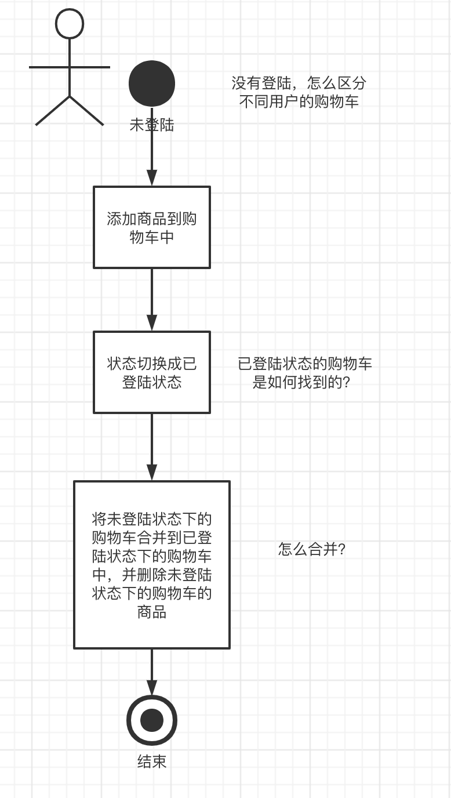
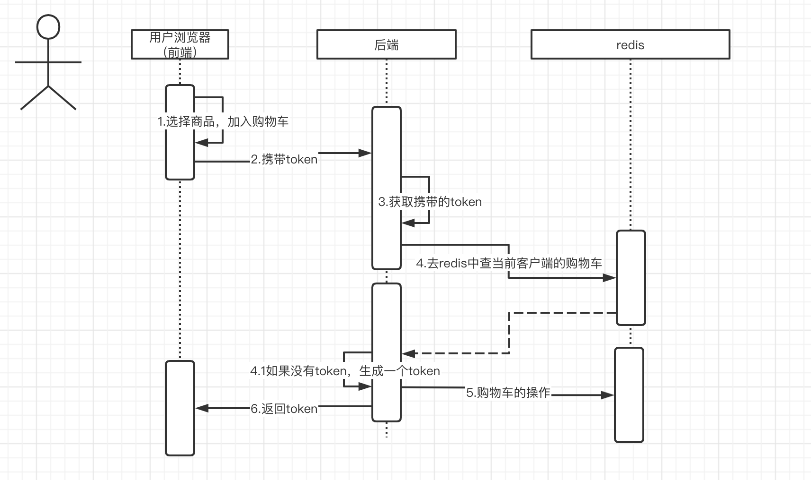
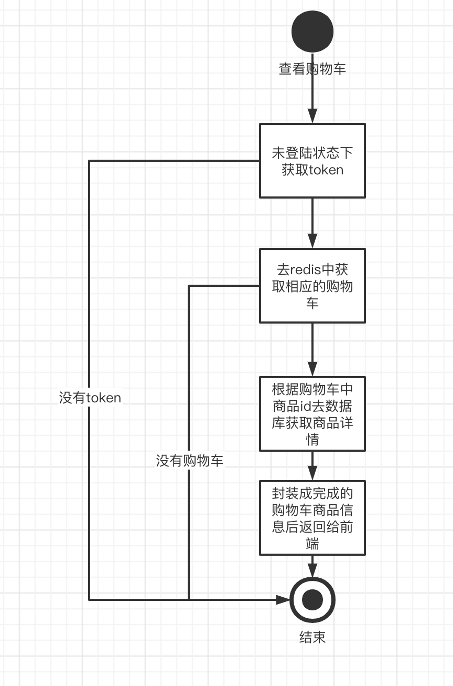
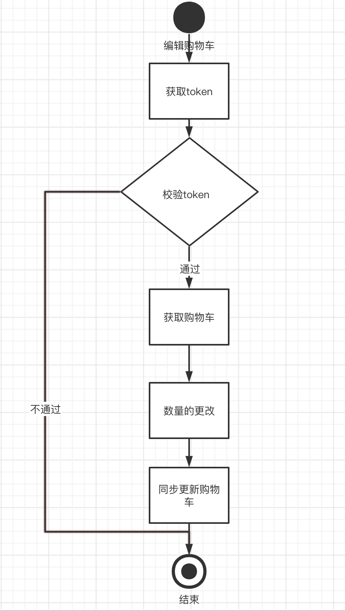
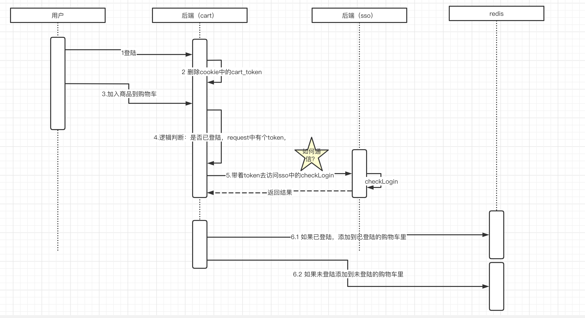
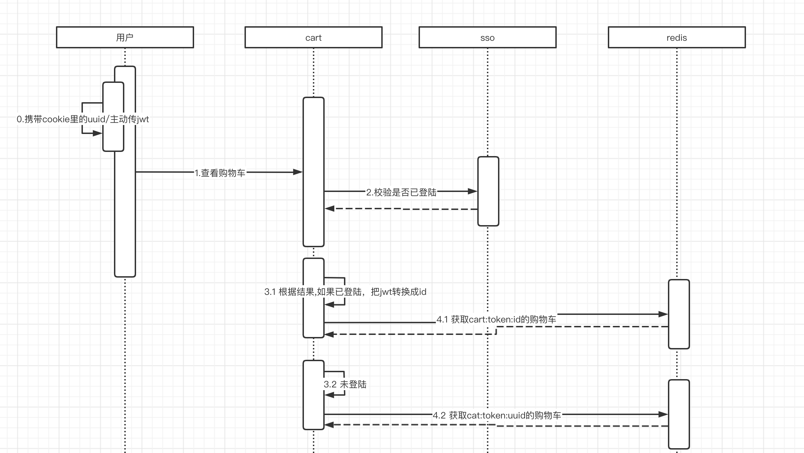
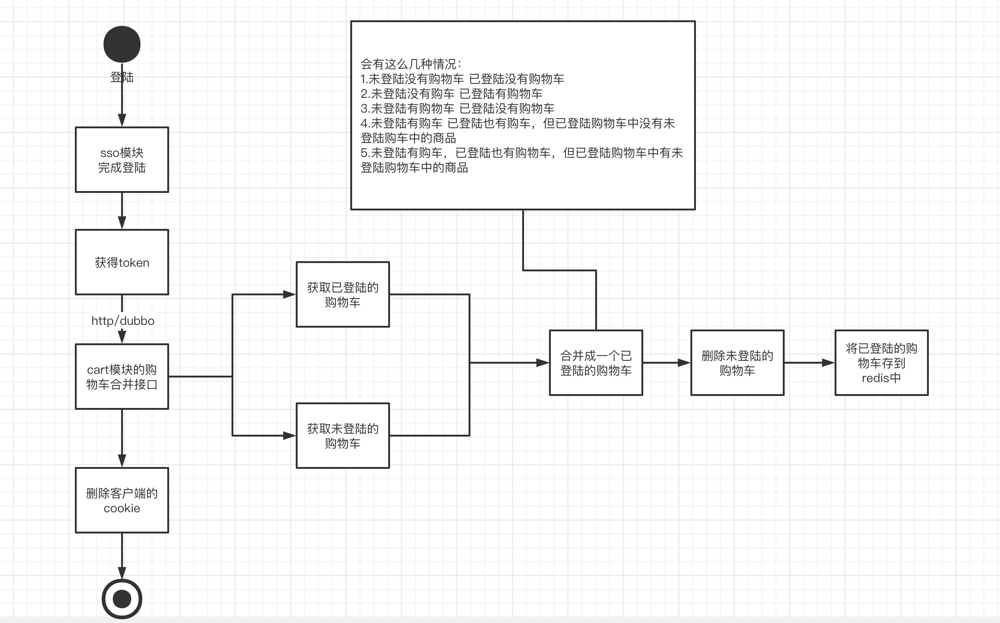
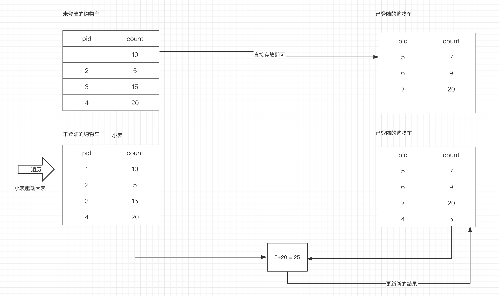
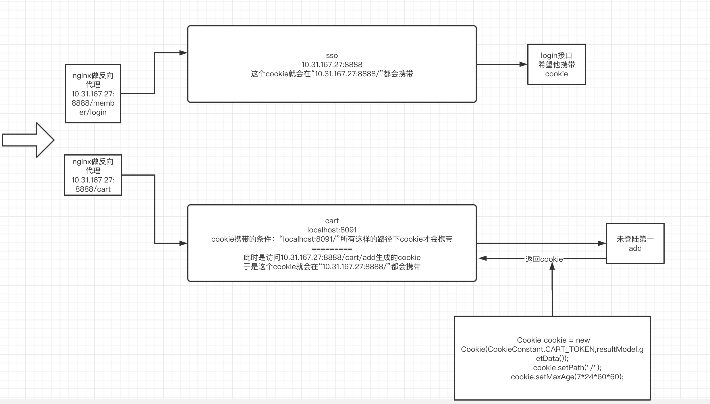

# 一、购物车业务介绍

## 1.目前主流的购物车业务架构

- 必须先登陆，才能加车： 淘宝、天猫
- 未登陆和已登陆都可以加车：京东

流程图：




## 2.两种状态下的购物车需要实现哪些接口

- 未登陆状态下添加商品到购物车
- 未登陆状态下更新购物车中的商品，比如更新商品数量
- 未登陆状态下删除购物车中的商品
- 已登陆状态下添加商品到购物车
- 已登陆状态下更新购物车中商品
- 已登陆状态下删除购物车中的商品
- 登陆后合并购物车，并删除未登陆状态下的购物车。


# 二、未登陆状态下购物车的接口实现

## 1.添加商品的业务流程

### 1）购物车存放在哪里？

存放在redis的hash。Map<String,Map<String,String>> map

- 键：cart:token:17716161 (描述用户客户端)
  - 商品id1001 ：1(count) 
  - 商品id1002 ：2(count)
- 键：cart:token:17728282 (描述用户客户端)
  - 商品id1009 ： 1(count) 
  - 商品id1004 ：3(count) 

### 2）如何在未登陆状态下标识某个客户端的所拥有的购物车

可以通过token来标识客户端所属的购物车，如果前端没有token，那么后端会生成一个，作为redis的键存入到购物车中，并将token返回给客户端本地进行保存（cookie）。




未登陆状态下添加购物车的几种情况：

- 未登陆状态下没有购物车
- 未登陆状态下有购物车但购物车中没有该商品
- 未登陆状态下有购物车但购物车中有该商品

核心业务代码：

```java
/*
    - 未登陆状态下没有购物车
    - 未登陆状态下有购物车但购物车中没有该商品
    - 未登陆状态下有购物车但购物车中有该商品
     */
    @Override
    public ResultModel<String> addCart(CartModelRequest request) {
        String token = request.getToken();
        if(StringUtils.isBlank(token)){
            //未登陆状态下没有购物车
            //create a token
            String cartToken = UUIDUtils.getUUID();
            //create redis key
            String redisKey = RedisUtil.crtRedisKey(RedisConstant.CART_TOKEN_PRE, cartToken);
            //向redis中添加购物车
            redisTemplate.opsForHash().put(redisKey,request.getPid(),request.getCount());
            //把token返回
            return ResultModel.success(cartToken);
        }
        //token有值
        //create redis key
        String redisKey = RedisUtil.crtRedisKey(RedisConstant.CART_TOKEN_PRE, token);
        Map cart = redisTemplate.opsForHash().entries(redisKey);
        if(Objects.isNull(cart) || cart.size()==0){
            //没有购物车,add
            redisTemplate.opsForHash().put(redisKey,request.getPid(),request.getCount());
            //把token返回
            return ResultModel.success(token);
        }
        //有购物车
        if (!cart.containsKey(request.getPid())) {
            //购物车中没有该商品
            redisTemplate.opsForHash().put(redisKey,request.getPid(),request.getCount());
            //把token返回
            return ResultModel.success(token);
        }
        //有购物车，购物车中有该商品
        //购物车中没有该商品
        int sum = (int)cart.get(request.getPid())+request.getCount();
        redisTemplate.opsForHash().put(redisKey,request.getPid(),sum);
        //把token返回
        return ResultModel.success(token);
    }
```


## 2.查看购物车中的商品



未登陆状态下查看购物车会有如下几种情况：

- 没有token——未登陆状态下没有购物车
- 有token，redis中没有购物车——未登陆状态下没有购物车
- 有购物车的。


## 3.更新购物车中的商品数量




# 三、已登陆状态下购物车的实现

## 1.添加商品到购物车接口

难点在于如何判断是否已登陆，通过请求的token来判断。如果用户完成登陆后，去添加商品到购物车，就需要前端去把token封装在这个request中。

```java
@Data
public class AddCartRequest implements Serializable {

    private String token;//如果是已经登陆，登陆完后会生成jwt，那么上游就需要封装这个token

    private Long pid;

    private int count;

}
```


当拿到用户携带的token，并不意味着必然是已登陆的，必须去sso验证一下。





## 2.查看已登陆状态下的购物车详情

具体的查看逻辑，兼容两种状态下的购物车的查看。




## 3.更新购物车接口的实现

根据与查看购物车相同的逻辑，只需要在service层传递token时要么是传递uuid（未登陆），要么传递id（已登陆）作为token。这样facade层的业务逻辑不需要调整。


# 四、登陆时两种状态的购物车合并

## 1.完成合并接口

当用户完成登陆动作以后，就必须让用户把cookie中的token删除掉。

登陆后要把两种状态的购物车合并，合并过程中涉及到较为复杂的业务逻辑




两种状态下都有购物车，该怎么去合并？



去循环未登陆状态下的购物车（小表），循环中获取商品id，去查看已登陆状态下购物车是否有该数据，如果没有，直接添加到redis，如果有，获取数量的和，再添加到redis（覆盖/更新）。


## 2.解决cookie的跨域

除了可以通过hosts本地dns文件来做让多个服务器ip属于同级的域名 ——这种方案解决跨域以外，这种方案只适合开发时实现。

更加通用的方案应该使用nginx做反向代理：



sudo rm -rf /usr/local/bin/npm
sudo rm -rf /usr/local/share/man/man1/node.1
sudo rm -rf /usr/local/lib/dtrace/node.d
sudo rm -rf ~/.npm
sudo rm -rf ~/.node-gyp
sudo rm /usr/local/bin/node
————————————————

                            版权声明：本文为博主原创文章，遵循 CC 4.0 BY-SA 版权协议，转载请附上原文出处链接和本声明。

原文链接：https://blog.csdn.net/tdjqqq/article/details/134135688
